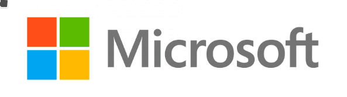
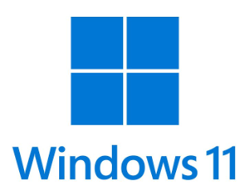

# `Operating Systems`

---

 

Covered in this file:
1. [`Hardware`](#hardware)
1. [`Firmware`](#firmware)
1. [`Drivers`](#drivers)
1. [`Software`](#software)
1. [`Defining Operating System`](#defining-operating-system)
1. [`Overview of Operating Systems`](#overview-of-operating-systems)

 

---

 

# `Hardware`
`Hardware` refers to the physical components of a computer system or electronic device. 
* This includes the central processing unit (CPU), memory (RAM), storage devices (hard drives, SSDs), input devices (keyboard, mouse), output devices (monitor, printer), and other physical parts that are integral to the operation of the device.

 

[Back To Top](#operating-systems)

---

 

# `Firmware`
`Firmware` is specialized software that is embedded into hardware devices to control their functions. 
* It is stored in non-volatile memory, such as ROM or flash memory, and provides low-level control for the hardware. 
* Firmware is essential for the basic operation of the device and is often updated to fix bugs or add functionality.

 

#### `Firmware Typically found on the motherboard:`

- `BIOS (Basic Input/Output System)`: The traditional firmware that initializes and tests hardware during the boot process, and provides an interface for the operating system to interact with the hardware.  

- `UEFI (Unified Extensible Firmware Interface)`: The modern replacement for BIOS, offering more advanced features and a graphical interface. UEFI handles the initial hardware initialization and boot process and provides an environment for managing hardware and system settings.

 

[Back To Top](#operating-systems)

---

 

# `Drivers`

`Device Drivers` are specialized software programs that allow the operating system and software applications to communicate with hardware devices. 
* They act as intermediaries between the operating system and hardware components, such as printers, graphics cards, or network adapters, enabling the hardware to function correctly.

* Device drivers are integrated into the kernel or loaded as kernel modules. They operate in kernel space, which is a protected area of memory with higher privileges compared to user space.
  - Drivers translate operating system commands into device-specific instructions
  - Drivers handle input/output operations
  - Drivers manage device-specific functions

 

[Back To Top](#operating-systems)

---

 

# `Software`
`Software` is a set of programs, instructions, and data that tells a computer or electronic device how to perform specific tasks. 
* Unlike hardware, which is the physical part of a computer, software is intangible—you cannot touch it.
* It encompasses all the non-hardware components, including operating systems, applications, and utilities that perform tasks and manage hardware resources.

 

Types of software:

1. `System Software:` Helps run the computer and manage hardware (e.g., operating systems like Windows, Linux, macOS).
2. `Application Software:` Performs specific tasks for users (e.g., Microsoft Word, web browsers, games).
3. `Programming Software:` Helps developers create other software (e.g., compilers, IDEs).

 

[Back To Top](#operating-systems)

---

 

# `Defining Operating System`

An `Operating System (OS)` is a software system that manages and controls the hardware and software resources of a computer or electronic device. 
It provides a user interface and acts as an intermediary between users, applications, and the hardware.

## Components of an Operating System

### `1. Kernel`

`Kernel`: The central component of the OS that manages system resources and hardware interactions.
* It provides essential services such as process management, memory management, hardware abstraction, and system calls. 
* The kernel operates in a privileged mode to ensure efficient and secure communication between hardware and software.

 

`Functions`:
  - Manages CPU, memory, and device drivers.
  - Handles process and memory management.
  - Provides system calls for applications to interact with hardware.
  - `File System`: Manages files and directories on storage devices.
  - `Device Drivers`: Software components that enable the OS to communicate with hardware devices.

 

A `system call` is a mechanism that allows a program or application to request a service from the operating system’s kernel. It is the formal interface between user-mode programs and the privileged kernel that controls hardware and core system resources.

--- 

 

### `2. Shell`

`Shell`: A command-line interface that allows users to interact with the kernel.
- `Functions`:
  - Executes commands and scripts.
  - Provides a text-based interface for file management and system operations.
  - Supports automation and scripting.

 

`Command Line Interface (CLI)`, is a text-based interface used to interact with the operating system. 
* Users enter commands in a terminal or command prompt to perform various tasks, such as file management, system configuration, and program execution. 

* The CLI allows for powerful and precise control over the system.

 

---

 

### `3. System Libraries`

`System Libraries`: Collections of pre-written code that applications can use.
- `Functions`:
  - Provide standard functions and routines for applications.
  - Facilitate communication between applications and the OS.
  - Include libraries for handling tasks like input/output, networking, and graphics.

 

---

### `4. Applications`
`Applications` : (often referred to as apps or software applications) are programs designed to perform specific tasks or functions for end users. 

 

`Functions`:
  - `User Interface`: Facilitates user interaction with the OS and applications.
      - Provides graphical (GUI) or command-line (CLI) interfaces.
  - `System Utilites`: Tools and programs that perform system maintenance and configuration tasks.
  - `Security Mechanisms`: Components that enforce security policies and protect the system.

 

A `Graphical User Interface GUI`: is a type of user interface that allows people to interact with a computer or electronic device through visual elements such as windows, icons, buttons, menus, and images, rather than typing text commands.

 

[Back To Top](#operating-systems)

---

 

# `Overview of Operating Systems`

## `Microsoft`

`Microsoft` is a multinational technology company headquartered in Redmond, Washington, founded in 1975 by Bill Gates and Paul Allen. It rose to prominence through its development of operating systems and productivity software, especially with MS-DOS and later the Windows family of operating systems. Over time, Microsoft expanded its business into many areas: cloud computing (Azure), developer tools (Visual Studio, GitHub), business applications (Dynamics), hardware (Surface, Xbox), online services (LinkedIn, Bing), and more.

 

### Microsoft Operating Systems
---
### MS-DOS

`MS-DOS` (Microsoft Disk Operating System) was a command-line operating system used on early IBM PC compatibles. Microsoft adapted and licensed it to many PC manufacturers, making it a dominant platform in the 1980s.

### Windows

`Windows` is Microsoft’s family of graphical operating systems built on top of or in combination with underlying system software. The Windows line allowed users to interact through windows, icons, menus, and pointers (WIMP paradigm), making personal computing more accessible to non-technical users. Over successive versions, Windows has become the de facto OS for many desktops and laptops worldwide.

---

 

# Unix

`Unix` is a family (or lineage) of operating systems originally developed in the late 1960s and early 1970s at AT&T’s Bell Labs, notably by Ken Thompson and Dennis Ritchie. Unix was designed with ideas like:

- Multitasking (running multiple processes concurrently)  
- Multiuser support  
- A hierarchical file system  
- Pipes and filters (small tools that can be chained)  
- Treating devices as files  

Its philosophy emphasized building small, modular programs that do one thing well, and combining them to achieve more complex tasks. Over time, Unix has influenced many modern operating systems, spawned many variants (e.g., BSD, Solaris), and inspired “Unix-like” systems such as Linux.

 

### FreeBSD

`FreeBSD` is a free and open-source Unix-like operating system derived from the Berkeley Software Distribution (BSD) branch of Unix. It is known for its performance, stability, and advanced networking features.

### GNU/Linux 

While `Linux` is not strictly a Unix descendant, it is built to behave similarly (“Unix-like”). Linux combines the Linux kernel (developed by Linus Torvalds) with the GNU userland tools, forming a complete operating system that offers many of the functionalities and concepts originating from Unix.

---

# Apple

`Apple Inc.` is a major technology company, founded in 1976 by Steve Jobs, Steve Wozniak, and Ronald Wayne. Apple is known for integrating hardware, software, and services in tightly controlled ecosystems, with a strong emphasis on design, usability, and premium user experience.

### macOS

Apple’s desktop/laptop operating system for Mac computers. macOS has its roots in Unix/BSD (and NeXTSTEP) and is officially certified as a `UNIX system` (UNIX 03 standard) in many versions. It provides both a graphical user interface and powerful command-line tools.

### iPadOS

A variation of iOS adapted for iPads, with enhancements for larger screens, multitasking, and stylus (Apple Pencil) input.

### iOS

The operating system for Apple’s iPhones (and formerly iPad and iPod Touch). iOS is based on the same core architecture as macOS, but optimized for touch input, energy conservation, and mobile constraints such as limited resources, battery life, and app sandboxing.

---

 

# Linux

`Linux` is an open-source, Unix-like operating system kernel initially created by Linus Torvalds in 1991. The kernel itself is the core part of the system that interacts with hardware, schedules tasks, manages memory, and handles drivers. 

While many people use the term “Linux” to describe full operating systems (like Ubuntu, Fedora, or Debian), technically those are Linux distributions—complete systems built around the Linux kernel, combined with GNU tools, libraries, and other software.

Because Linux is open source, anyone can view, modify, and distribute its code (subject to licensing terms such as the GNU General Public License).

### Linux Distros
A `Linux distribution` is a packaged operating system built around the Linux kernel plus a collection of software, tools, and package management systems. Distros differ in goals, base components, desktop environments, and target audiences.

| `Distro`       | `Description` |
|------------------|-----------------|
| `Debian`       | Stable and foundational distribution emphasizing free software, robustness, and a large repository of packages. |
| `Ubuntu`       | Based on Debian, aims to be user-friendly with frequent releases, good hardware support, and ease of use. |
| `Linux Mint`   | Based on Ubuntu or Debian, provides a traditional desktop experience with simplicity and out-of-the-box readiness. |
| `Raspberry Pi OS` | Lightweight Debian-based distro tailored for Raspberry Pi hardware, optimized for low-resource environments. |
| `Red Hat (RHEL/Fedora)` | RHEL is a commercial, stable distribution for enterprises; Fedora is community-driven, cutting-edge, and experimental. |
| `SUSE (openSUSE/SUSE Enterprise)` | Strong tools for system administration, with both community and enterprise versions. |
| `Arch Linux`   | A rolling-release distro emphasizing minimalism, user control, and cutting-edge software. |
| `Gentoo`       | Source-based distro where most software is compiled from source, offering deep customization. |
| `Slackware`    | One of the oldest distros, emphasizing simplicity, minimalism, and hands-on administration. |

---

# Google

“`Google`” can refer to two closely related things:

1. `Google the Company` – Google LLC is an American multinational tech company best known for its search engine. Over time, it expanded into online advertising, cloud computing (Google Cloud Platform), mobile operating systems (Android), browsers (Chrome), hardware (Pixel, Chromebooks, Nest), AI, and more.  
2. `Google the Search Engine` – The widely used web search service indexing the web and allowing users to find information, websites, images, videos, and more.

### Google Operating Systems

### Android

- `Android`: A mobile OS for smartphones and tablets, based on a modified Linux kernel with a large app ecosystem via Google Play. 

### ChromeOS

- `ChromeOS`: A lightweight OS for Chromebooks, built around the Chrome browser. Emphasizes speed, simplicity, and cloud-based operation, with support for web apps and Android apps.

 

[Back To Top](#operating-systems)

---

 

*Created and maintained by Mr. Merritt*