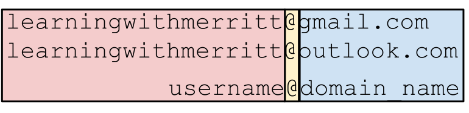

# `Electronic Mail`
<br>

___

<br>

Covered in this file:
1. [`Email`](#email)
1. [`Parts of an Email Address`](#parts-of-an-email-address)
1. [`Email Ports and Protocols`](#email-ports-and-protocols)
1. [`Common Email Clients`](#common-email-clients)
1. [`Email Servers`](#email-servers)
1. [`How Email Works`](#how-email-works)
1. [`Email Headers`](#email-headers)
1. [`Gmail Client Search Terms`](#gmail-client-search-terms)


<br>

[Back To Top](#electronic-mail)
___

<br>

# `Email`
`Email (electronic mail)`is a method of exchanging digital messages between people through electronic devices. 
* It's similar to traditional mail but uses computer networks instead of physical delivery systems.


[Back To Top](#electronic-mail)
___

<br>

# `Parts of an Email Address`
An email address typically consists of two main parts, separated by the "@" symbol: the local part and the domain part.



|local_part|@|domain_part|
|:-:|:-:|:-:|
|username|@|domain name|
|learningwithmerritt|@|gmail.com|
|learningwithmerritt|@|outlook.com|
|learningwithmerritt|@|icloud.com|
|learningwithmerritt|@|proton.me|
|learningwithmerritt|@|yahoo.com|

<br>

Some emails providers allow tagging, where the local part is followed by a '+' and tag. 

Example:
```  
learningwithmerritt+example@gmail.com
```

<br>

[Back To Top](#electronic-mail)
___

<br>

# `Email Ports and Protocols`

`SMTP Simple Mail Transfer Protocol`

`SMTP` is the standard protocol for transferring emails between servers. 
* In simpler terms, it's the language email servers use to talk to each other and deliver your messages.

|Protocol|Port|
|:-:|:-:|
|`SMTP`|`25`|
|`SMTPS`|`587`|


<br>

___


`IMAP( Internet Message Access Protocol)`

`IMAP` is a standard protocol that allows you to retrieve and manage your emails on a remote server from various devices. 
* Unlike `POP3`, which downloads and stores emails locally, `IMAP` keeps them on the server, giving you more flexible access.

|Protocol|Port|
|:-:|:-:|
|`IMAP`|`143`|
|`IMAPS`|`993`|

<br>

___

`POP3 (Post Office Protocol version 3)`

`POP3` is an email retrieval protocol used to download emails from a mail server to your local device. 
* Think of it like going to the post office to pick up your mail; you download the messages and then they're removed from the server.

|Protocol|Port|
|:-:|:-:|
|`POP3`|`110`|
|`POP3S`|`995`|

<br>

___

*What is the “S”? It stands for secure and means the protocol is running on top of an encryption protocol.*

`TLS` and `SSL` are cryptographic protocols used to create a secure communication channel between two parties on a network. 
* `TLS` has superseded `SSL` and is more commonly used today. 

<br>

[Back To Top](#electronic-mail)
___

<br>

# `Common Email Clients`
An `email client` is a software application or web interface used to access, manage, and send emails from an email account.  
* Some clients store emails locally, or help you access them on the server

<br>

### `Desktop clients that run on you local device`:
* Microsoft Outlook
* Mozilla Thunderbird
* Apple Mail

<br>

### `Web-base clients that run on a remote server`:
* gmail.com
* icloud.com
* outlook.com
* proton.me

<br>

[Back To Top](#electronic-mail)
___

<br>

# `Email Servers`

An `email server` is a computer system or application that handles the sending, receiving, routing, and storage of emails.
* Email Servers act as a digital mail box
* Protocols like `SMTP`, `IMAP`, and `POP3` are used to communicate with other servers, deliver, and retrieve email

<br>

[Back To Top](#electronic-mail)
___

<br>

# `How Email Works`

<br>


<br>

`Email Uses a Client-Server Model`
* An `Email Client` is on your device or accessed on a web page.
* An `Email Server` is typically hosted by servers on the internet.
    * Clients provide user interface and management, while servers handle email flow and storage.

*You need both to function: client to view/manage, server to store/deliver emails.*

<br>

`Webmail Interfaces & Mobile Apps:` 

* `Web applications` and `mobile apps` that connect to the email servers through protocols like `IMAP` and `POP3` are not true clients, but still provide the functionality of a client. 
* You access your emails through these interfaces, but they are not technically installed on your device. 
* They act as a window to your emails stored on email servers.

<br>

## `What happens when you send an email:`
1. `Message is composed and formatted to SMTP standards`
    * The client sends the email, including sender and recipient information, subject, body, and any attachments.

<br>


2. `Sender’s Email Client resolves the IP address (DNS) of the Recipients Mail Server.` 
    * The sender's email client first looks up the recipient's mail server's IP address using the Domain Name System (DNS). 
    * This is like using a phone book to find a phone number.

<br>

3. `Sender Email Client sends email to the Sender SMTP Server.`
    * The client connects to the sender's outgoing mail server (SMTP) using the appropriate port (typically 587 for secure SMTP).

<br>

4. `Sender SMTP to Recipient SMTP Server`
    * The server checks your authentication and if everything is valid, it routes the email to the recipient's server.
    * The sender's SMTP server communicates with the recipient's SMTP server, relaying the email along the way.
    * Multiple servers might be involved, depending on email providers and network routing.

<br>

5. `Recipient SMTP Server stores the mail`
    * The recipient's server holds the email until the recipient checks their email.
    * It might perform spam filtering and checks for viruses.

<br>

6. `Recipient Email Client retrieves the email from the SMTP Server using IMAP, or POP3`
    * When the recipient opens their email client, it connects to the incoming mail server (IMAP or POP3) using the appropriate port (e.g., 993 for IMAP).
    * IMAP allows for viewing and managing emails on the server, while POP3 typically downloads emails to the client device.
    * The server sends the email to the recipient's client, where they can read and respond.

<br>

`Additional Points:`

`Authentication:` Both sender and recipient servers typically require authentication to ensure authorized access.

`Encryption:` Secure protocols (TLS/SSL) are used to encrypt email data during transmission for privacy and security.

`Message Headers:` Emails contain headers that store information like sender, recipient, date, subject, routing information, and more.

`Delivery Status Notifications (DSNs)`: These can be used to track email delivery and provide feedback on delivery failures.

<br>

[Back To Top](#electronic-mail)
___

<br>

# `Email Headers`
`Email Headers are information that is not typically displayed with the email, but contain metadata about the email. `
| Field           | Description                                                             |
|------------------|-------------------------------------------------------------------------|
| `Sender`       | Name and email address of the person who sent the message.             |
| `Recipient`    | Name and email address of the intended recipient(s).                   |
| `Subject`      | Brief summary of the email's content.                                  |
| `Date and Time`| When the email was sent.                                               |
| `Reply-To`     | Alternative address for replies (may differ from sender).              |
| `Message-ID`   | Unique identifier for the specific email.                              |
| `Content-Type` | Specifies the format of the email body (text, HTML, etc.).             |

<br>

Additional Information (May vary):
| Field                  | Description                                                               |
|-------------------------|---------------------------------------------------------------------------|
| `Routing Information`   | Shows the path the email took to reach the recipient, listing servers it passed through. |
| `Authentication Details`| Indicates if the sender's identity was verified.                        |
| `Spam Filters`          | Flags used by servers to identify potential spam.                       |
| `Priority`              | High, Normal, Low (not always used).                                    |
| `Delivery Notifications`| Whether the sender receives reports about delivery success or failure.  |
| `Custom Headers`        | Some senders include specific information unique to their message.      |


<br>

[Back To Top](#electronic-mail)
___

<br>

# `Gmail Client Search Terms`
| Search Purpose                                           | Operator/Example                                                   |
|----------------------------------------------------------|--------------------------------------------------------------------|
| **Specify the sender**                                   | `from:` <br> Example: `from:amy`                                        |
| **Specify a recipient**                                  | `to:` <br>  Example: `to:david`                                          |
| **Specify a recipient who received a copy (cc or bcc)**  | `cc:` <br>  `bcc:` <br>  Example: `cc:david`                                   |
| **Words in the subject line**                            | `subject:` <br>  Example: `subject:dinner`                               |
| **Messages that match multiple terms**                  | `OR` or `{ }`  <br> Example: `from:amy OR from:david`                   |
|                                                          | Example: `{from:amy from:david}`                                   |
| **Remove messages from your results**                   | `-`  <br> Example: `dinner -movie`                                       |
| **Find messages with words near each other**            | `AROUND` <br>  Example: `holiday AROUND 10 vacation`                    |
|                                                          | Example: `"secret AROUND 25 birthday"`                             |
| **Messages that have a certain label**                  | `label:` <br>  Example: `label:friends`                                 |
| **Messages that have an attachment**                    | `has:` <br>  Example: `has:attachment`                        |
| **Messages with a Google Drive, Docs, Sheets, or Slides attachment or link** | `has:drive` <br>  `has:document`  <br> `has:spreadsheet`  <br> `has:presentation`  |
| **Messages with a YouTube video**                       | `has:youtube`                             |
| **Messages from a mailing list**                        | `list:` <br>  Example: `list:info@example.com`                          |
| **Attachments with a specific name or file type**       | `filename:` <br>  Example: `filename:pdf`  <br> Example: `filename:homework.txt` |
| **Search for an exact word or phrase**                  | `" "` <br>  Example: `"dinner and movie tonight"`                       |
| **Group multiple search terms together**                | `( )` <br>  Example: `subject:(dinner movie)`                           |
| **Messages in any folder, including Spam and Trash**    | `in:anywhere` <br>  Example: `in:anywhere movie`                        |
| **Search for messages marked as important**             | `is:important` or `label:important` <br>  Example: `is:important`       |
| **Starred, snoozed, unread, or read messages**          | `is:starred` <br>  `is:snoozed` <br>  `is:unread` <br>  `is:read` |
| **Messages with an icon of a certain color**            | `has:yellow-star` `has:blue-info`  <br>  Example: `has:purple-star`      |
| **Recipients in the cc or bcc field**                   | `cc:` <br>  `bcc:` Example: `cc:david`                                  |
| **Search for messages sent during a certain time period** | `after:` <br>  `before:` <br>  `older:` <br>  `newer:`  <br>  Example: `after:2004/04/16` <br>  Example: `before:2004/04/18` |
| **Search for messages older or newer than a time period**| `older_than:` <br>  `newer_than:` <br>  Example: `newer_than:2d`       |
| **Search by email for delivered messages**              | `deliveredto:` <br>  Example: `deliveredto:username@gmail.com`          |
| **Messages in a certain category**                      | `category:` <br>  Example: `category:updates`                          |
| **Messages larger than a certain size in bytes**        | `size:` <br>  Example: `size:1000000`                                   |
| **Messages larger or smaller than a certain size**      | `larger:` <br>  `smaller:` <br>  Example: `larger:10M`                        |
| **Results that match a word exactly**                   | `+`  <br> Example: `+unicorn`                                           |
| **Messages with a certain message-id header**           | `rfc822msgid:` <br>  Example: `rfc822msgid:200503292@example.com`       |
| **Messages that have or don't have a label**            | `has:userlabels` <br>  `has:nouserlabels` <br>  Example: `has:nouserlabels`  |


<br>

[Back To Top](#electronic-mail)
___

<br>

*Created and maintained by Mr. Merritt*