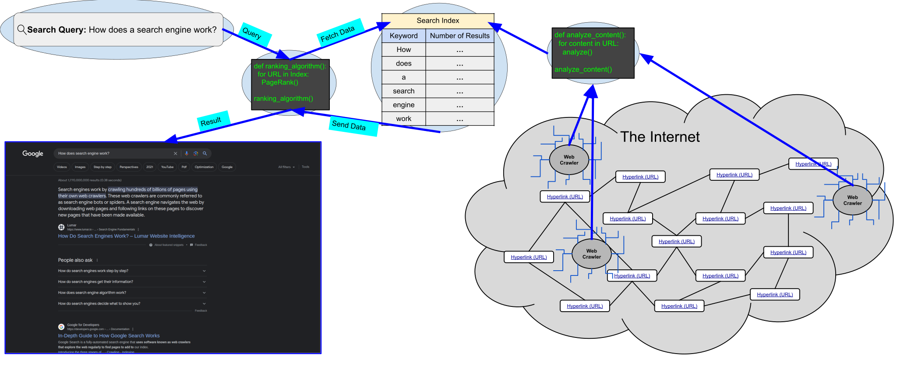

# `Search Engines`

<br>

___

<br>

Covered in this file:
1. [`What is a search engine?`](#what-is-a-search-engine)
1. [`Internet Search Engines`](#internet-search-engines)
1. [`How does a search engine work?`](#how-does-a-search-engine-work)
1. [`Crafting Basic Queries`](#crafting-basic-queries)
1. [`Advanced Search Operators`](#advanced-search-operators)

<br>

___

<br>


# `What is a search engine?`

A `search engine` is a software program that helps people find information online by indexing websites and then matching those websites to the search query. 
* When a search term is entered, the search engine looks at its index and returns a list of websites that it thinks are relevant to the query. 

<br>

A `web crawler`, also known as a spider or spiderbot, is an automated program that systematically browses the World Wide Web, gathering information and performing various tasks like indexing websites for search engines. 

<br>

A `search query` is a set of keywords or a phrase that you enter into a search engine to find information on the internet. 

<br>

[Back To Top](#search-engines)

___

<br>

# `Internet Search Engines`

The First Search Engine: [Archie](https://web.archive.org/web/19961119110343/http://archie.icm.edu.pl/archie_eng.html)

The following is a list of the most popular search engines in the world as of 2024, along with their market share
|Search Engine| Percentage|
|:-:|:-|
|[Google](https://www.google.com/)| 91.58%|
|[Microsoft Bing](https://www.bing.com/)| 3.01%|
|[Yahoo](https://www.yahoo.com/)| 1.23%|
|[Baidu](https://www.baidu.com/)| dominates the Chinese market with over 76% market share.|
|[Yandex](https://yandex.com/)|  dominant search engine in Russia, Yandex holds around 46% market share in the country. |
|[DuckDuckGo](https://duckduckgo.com/)| 0.63%|
|[Ask.com](https://www.ask.com/)| 0.12%|
|[Ecosia](https://www.ecosia.org/)| 0.08%|

Some Others:
[StartPage](https://www.startpage.com/)
[SearchEncrypt](https://www.searchencrypt.com/home)
[OneSearch](https://www.onesearch.com/)
[SwissCows](https://swisscows.com/en?culture=en)

<br>

[Back To Top](#search-engines)

___

<br>

# `How does a search engine work?`

A `search engine` works by using automated programs called crawlers or spiders to systematically browse and index web pages across the internet. 
* The search engine then stores this indexed information in a massive database. 
* When a user submits a query, the search engine's algorithm analyzes the query, retrieves the most relevant indexed pages, and ranks them based on factors like keyword relevance, page authority, and user experience, before displaying the results to the user.

<br>

### 1. `Web Crawling:`
* Search engines use automated programs called crawlers or spiders to explore the web. 
* These crawlers start from a set of known web pages and follow links to discover new pages. 
* They continuously move from one page to another, collecting information along the way.

<br>

### 2. `Indexing:`
* As the crawlers visit web pages, they analyze and index the content. 
* Indexing involves organizing the information in a structured way that makes it easier to retrieve later. 
* This process typically involves creating an inverted index, which maps keywords to the web pages that contain them.

<br>

### 3. `Ranking:`
* After indexing, the search engine needs to determine the relevance of each indexed page to specific search queries. 
* Algorithms are employed to assign a rank or score to each page based on various factors, including keyword relevance, page quality, user engagement metrics, and other considerations. 
* Pages that are deemed more relevant are displayed higher in search results.

<br>

### 4. `Query Processing:`
* When a user enters a search query, the search engine processes the query to understand its intent. 
* This involves `parsing` the query, identifying keywords, and applying any special rules or filters.


`Parsing`, also known as syntax analysis, refers to the process of analyzing a string of symbols, be it in natural language, computer languages, or data structures, according to the rules of a defined grammar. 

*The word `parse` itself originates from the Latin term "pars orationis," meaning "part of speech."*

<br>

### 5. `Retrieval:`
* The search engine then retrieves relevant documents from its indexed database based on the user's query. 
* The documents are ranked according to their relevance scores.

<br>

### 6. `Presentation of Results:`
* Finally, the search engine displays the results to the user. 
* Typically, the results are presented on a search engine results page (SERP), showing a list of links with brief descriptions (snippets) and other relevant information. 
* Users can click on the links to access the full content of the pages.

<br>

## Diagram


*Having trouble viewing on Github? Try Right-Clicking on the image and selecting "Open image in a new tab"*

<br>

[Back To Top](#search-engines)

___

<br>

# `Crafting Basic Queries`

1. Use keywords, not questions
1. Review the search engine results page (SERP)
1. Refine your search with new keywords, synonyms, etc.
1. Iterate (repeat)

<br>

[Back To Top](#search-engines)

___

<br>

# `Advanced Search Operators`
* `Google Dorking` or `Google Hacking` is the practice of using advanced search operators and techniques within Google search to find information that might not be readily available through standard searches  

* A `dork` is simply a specific search query that uses these advanced operators in a unique way.  

<br>

## `Search Filters:`
|Filter| Description| Example|
|:-:|:-|:-:|
|allintext:|Searches for occurrences of all the keywords given.|allintext:"keyword"
|intext:|Searches for the occurrences of keywords all at once or one at a time.|intext:"keyword"
|inurl:|Searches for a URL matching one of the keywords.|inurl:"keyword"|allinurl:|Searches for a URL matching all the keywords in the query.|allinurl:"keyword"
|intitle:|Searches for occurrences of keywords in title all or one.|intitle:"keyword"
|allintitle:|Searches for occurrences of keywords all at a time.|allintitle:"keyword"
|site:|Specifically searches that particular site and lists all the results for that site.|site:"www.google.com"
|filetype:|Searches for a particular filetype mentioned in the query.|filetype:"pdf"
|link:|Searches for external links to pages.|link:"keyword"
|numrange:|Used to locate specific numbers in your searches.|numrange:321-325
|before:YYYY-MM-DD <br> after:YYYY-MM-DD|Used to search within a particular date range.|filetype:pdf & (before:2000-01-01 after:2001-01-01)
|allinanchor:<br>inanchor:|This shows sites which have the keyterms in links pointing to them, in order of the most links.|inanchor:rat
|allinpostauthor:<br>inpostauthor:|Exclusive to blog search, this one picks out blog posts that are written by specific individuals.|allinpostauthor:"keyword"
|related:|List web pages that are “similar” to a specific web page.|related:www.google.com
|cache:|Shows the version of the web page that Google has in its cache.|cache:www.google.com

<br>

## `Search Operators:`
|Operator| Description| Example|
|:-:|:-|:-:|
|Exact Term (“”)|This operator searches for the exact phrase within speech marks only. This is ideal when the phrase you are using to search is ambiguous and could be easily confused with something else, or when you’re not quite getting relevant enough results back.|"Tinned Sandwiches"|
|OR ( \| )|This self explanatory operator searches for a given search term OR an equivalent term.|site:facebook.com | site:twitter.com|
|AND ( & )|This self explanatory operator searches for a given search term AND an equivalent term.|site:facebook.com & site:twitter.com|
|Operator Combination|Operators can be combined|(site:facebook.com \| site:twitter.com) & intext:"login" <br>(site:facebook.com \| site:twitter.com) & (intext:"login")|
|Include results ( + )|Include results with the occurance of a specific keyword|-site:facebook.com +site:facebook.*|
|Exclude results ( - )|Exclude results with the occurance of a specific keyword|site:facebook.* -site:facebook.com|
|Synonyms ( ~ )|Adding a tilde to a search word tells Google that you want it to bring back synonyms for the term as well. For example, entering “~set” will bring back results that include words like “configure”, “collection” and “change” which are all synonyms of “set”. Fun fact: “set” has the most definitions of any word in the dictionary.|~set|
|Glob pattern<br>Wildcard Operator ( * )|Putting an asterisk in a search tells Google ‘I don’t know what goes here’. Basically, it’s really good for finding half remembered song lyrics or names of things.|site:*.com

<br>

## `Example Google Dorks`
```
intext:"index of /"
```
```
Nina Simone intitle:”index.of” “parent directory” “size” “last modified” “description” I Put A Spell On You (mp4|mp3|avi|flac|aac|ape|ogg) -inurl:(jsp|php|html|aspx|htm|cf|shtml|lyrics-realm|mp3-collection) -site:.info
```
```
Bill Gates intitle:”index.of” “parent directory” “size” “last modified” “description” Microsoft (pdf|txt|epub|doc|docx) -inurl:(jsp|php|html|aspx|htm|cf|shtml|ebooks|ebook) -site:.info
```
```
parent directory DVDRip -xxx -html -htm -php -shtml -opendivx -md5 -md5sums
```
```
parent directory MP3 -xxx -html -htm -php -shtml -opendivx -md5 -md5sums
```
```
parent directory Name of Singer or album -xxx -html -htm -php -shtml -opendivx -md5 -md5sums
```
```
filetype:config inurl:web.config inurl:ftp
```
```
“Windows XP Professional” 94FBR ext:(doc | pdf | xls | txt | ps | rtf | odt | sxw | psw | ppt | pps | xml) (intext:confidential salary | intext:"budget approved") inurl:confidential
```
```
ext:(doc | pdf | xls | txt | ps | rtf | odt | sxw | psw | ppt | pps | xml) (intext:confidential salary | intext:”budget approved”) inurl:confidential
```

<br>

[Back To Top](#search-engines)

___

<br>

*Created and maintained by Mr. Merritt*

