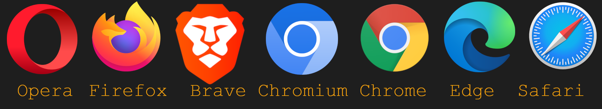

# `Web Browsing`
 

___

 

Covered in this file:
1. [`Internet v. World Wide Web`](#internet-vs-world-wide-web-www)
1. [`Web Browsers`](#web-browsers)
1. [`Browsing the World Wide Web`](#browsing-the-world-wide-web)
1. [`Hyperlinks`](#hyperlinks)
1. [`Parts of a Web Browser`](#parts-of-a-web-browser)
1. [`Keyboard Shortcuts For Web Browsers`](#keyboard-shortcuts-for-web-browsers)

 

___

 

# `Internet vs. World Wide Web (www)`
The `Internet` is a global network of interconnected computers and servers that communicate using standardized protocols, enabling the exchange of information, access to online services, and interaction between users worldwide.

 

The `World Wide Web (www)` is a system of interlinked hypertext documents and multimedia content accessed via the internet, enabling users to browse and interact with websites through web browsers.

 

`Basically`: The `Internet` is the underlying communication network that the `World Wide Web` sits on top of allowing for the transfer of web files.

 

| Feature                  | `INTERNET `                      |**vs.**           | `WORLD WIDE WEB`                           |
|--------------------------|-------------------------------------------|---------------------------------------------|--|
| **Definition**           | A global network of interconnected devices and systems. |**vs.**| A system of information and resources accessed through the Internet. |
| **Purpose**              | Facilitates communication and data exchange. |**vs.**| Provides access to websites, multimedia, and documents. |
| **Technology**           | Includes hardware, protocols (e.g., TCP/IP), and infrastructure. |**vs.**| Uses HTTP/HTTPS, browsers, and web servers. |
| **Scope**                | Broader, includes email, file transfer, online gaming, IoT, etc. |**vs.** |Narrower, limited to web-based resources and services. |
| **First Development**    | Originated in the 1960s (ARPANET).        |**vs.**| Invented in 1989 by Tim Berners-Lee.      |
| **Access**               | Can involve various protocols like FTP, SMTP, Telnet, etc. |**vs.** |Primarily accessed through web browsers.  |
| **Example Services**     | Email, VoIP, file sharing, remote login.  |**vs.**| Websites, search engines, e-commerce platforms. |

 

___

[Back To Top](#web-browsing)

 

# `Web Browsers`
A `Web Browser (Browser)` is a software application that enables users to access, retrieve, and interact with content on the `World Wide Web` by interpreting and displaying web pages from remote servers, allowing navigation through `hyperlinks` and support for various web technologies like `HTML`, `CSS`, and `JavaScript`.  

 

## `Common Web Browsers`:
`Chromium`: an open-source browser project that forms the basis for some of the most widely used web browsers globally, including Google Chrome, Microsoft Edge, Opera, Brave, Vivaldi, and more.  

 

`Open Source` refers to a set of principles and practices surrounding the development and distribution of software; its core philosophy is transparency and collaboration, making the underlying code or source material freely accessible to anyone.  

 

### `Browsers Based on Chromium`
| Browser   | Description                                                                                     |
|-----------|-------------------------------------------------------------------------------------------------|
| `Chrome`| A free, open-source web browser developed by Google. It is the most popular web browser globally, with over 2.6 billion users. |
| `Edge`  | A web browser developed by Microsoft, based on the Chromium open-source project. Available for Windows, macOS, Android, and iOS. |
| `Brave` | A free, open-source web browser focused on privacy and security. Blocks ads by default and includes a built-in cryptocurrency wallet. |
| `Opera` | A free, cross-platform web browser developed by Opera Software. Known for features like a built-in VPN and tab stacking. Based on the Chromium open-source project. |

 

### `Browsers Not Based on Chromium`
| Browser   | Description                                                                                     |
|-----------|-------------------------------------------------------------------------------------------------|
| `Firefox` | A free, open-source web browser developed by the Mozilla Foundation. Known for its focus on privacy and customization. |
| `Safari`  | A web browser developed by Apple. It is the default web browser on Apple devices, such as iPhones, iPads, and Macs. |

 

*This is not an exhaustive list, there are many more web browsers, these are just the most popular and available.*  

*Having trouble viewing on Github? Try Right-Clicking on the image and selecting "Open image in a new tab"*

 

___

[Back To Top](#web-browsing)

 

# `Browsing the World Wide Web`

*Having trouble viewing on Github? Try Right-Clicking on the image and selecting "Open image in a new tab"*

| Step                            | Description                                                                                           |
|---------------------------------|-------------------------------------------------------------------------------------------------------|
| **`1. Client Request`**           | The browser sends an HTTP request to the web server hosting the page when you enter a URL or click a link.|
|                                 |                                      |
| **`2. Server Response`**          | The server responds with the `HTML` code, which acts as the basic framework of the page.    The browser downloads this `HTML` code to your device.                    |
|                                 ||
| **`3. Browser Requests Resources`** | The `HTML` code often references other resources like images, `CSS` stylesheets, `JavaScript` files, videos, etc.    The browser makes separate requests to download these resources from their respective locations.             |
|                                 ||
| **`4. Web Page Rendering`**       | Once the `HTML` and essential resources are downloaded, the browser starts rendering (building) the page visually.    It interprets the `HTML` structure, applies `CSS` styles, and executes `JavaScript` code to create the interactive page you see.    In the context of a webpage, `rendering` refers to the process of taking the raw code (`HTML`, `CSS`, and `JavaScript`) and transforming it into the visual and interactive experience you see on your screen.      |
|                                 | |
| **`5. Browser Caching`**          | To speed up future visits, the browser stores some of the downloaded resources in its `cache` (local storage). This way, it doesn't need to download them again if you revisit the same page or site.     A `cache` is a temporary storage area that holds frequently accessed data or files for quicker retrieval. It acts as a middleman, storing information closer to where it's needed, reducing the time and effort required to access it again.     |
|                                 | |

 

___

[Back To Top](#web-browsing)

 

# `Hyperlinks`

`Hyperlinks or simply links`, are clickable references to data that directs you to another location. It's like a digital shortcut that allows you to navigate through information quickly and easily.

 

Hyperlinks are made of two parts:
* `Anchor text`: The visible part of the link, usually displayed as underlined text or an image.
* `URL (Uniform Resource Locator)`: The hidden web address behind the anchor text, specifying the location of the linked data.

 

There are two types of Hyperlinks:
* `Internal Hyperlinks`: Links to different sections within the same document or website.
* `External Hyperlinks`: Links to entirely different websites or online resources.

## [This is the anchor text of a Hyperlink](https://www.youtube.com/@learningwithmerritt)

 

___

[Back To Top](#web-browsing)

 

# `Parts of a Web Browser`

| Part            | Description                                                                                     |
|------------------|-------------------------------------------------------------------------------------------------|
| `Tab`         | Displays a webpage, allowing users to open multiple pages within the same browser window.       |
| `Address Bar` | Allows users to enter and view the URL of a webpage, and sometimes perform searches directly.    |
| `Title Bar`   | Shows the title of the currently active webpage or application.                                 |
| `Navigation Buttons` | Includes back, forward, and refresh/reload buttons to navigate webpages.                 |
| `Bookmarks Bar` | A toolbar for quick access to saved bookmarks.                                               |
| `Search Bar`  | An integrated field for performing searches, sometimes combined with the address bar.           |
| `Menu Bar`    | Contains dropdown menus for browser settings, history, extensions, and other tools.             |
| `Status Bar`  | Displays loading progress, link previews, or connection status (often at the bottom of the window). |
| `Scroll Bar`  | Allows users to navigate vertically or horizontally within a webpage.                           |
| `Extensions/Plugins Area` | Icons or tools added to the browser via extensions for additional functionality.    |
| `Viewport`    | The main area where the webpage content is displayed.                                           |
| `Tab Bar`     | Displays all open tabs and allows switching between them.                                       |

 

___

## `Developer Tools`

`Developer Tools (DevTools)` are a collection of built-in features or additional software programs specifically designed to aid software developers in creating, testing, and debugging. 
* In browsers DevTools are built-in features for inspecting and debugging web pages. 

 

Common Tools Included in Browser DevTools
* `Device Mode`: Emulate different devices (phones, tablets, etc.) to test responsive design.
* `Elements`: Inspect and modify the HTML structure of the webpage
* `Styles`: Inspect and edit the CSS styles applied to each element.
* `Sources`: View and edit the source code of the webpage, including HTML, CSS, and JavaScript.
* `Network`: Monitor all network requests made by the webpage.
* `Console`: Log messages and run JavaScript code directly in the browser.

Others:
* Performance: Analyze the webpage's rendering performance, identify bottlenecks, and optimize for speed.
* Memory: Identify memory leaks and other memory-related issues impacting web page performance.
* Applications: Inspect and manage web app storage, cookies, and service workers.
* Security: View security certificates, inspect cookies, and analyze potential security vulnerabilities.
* Audits: Run automated checks to identify accessibility issues, performance optimizations, and best practices.

 

 

*Having trouble viewing on Github? Try Right-Clicking on the image and selecting "Open image in a new tab"*

 

`Cookies` are small text files stored by websites on your device to remember preferences, login information, tracking data, and more.  

 

*Having trouble viewing on Github? Try Right-Clicking on the image and selecting "Open image in a new tab"*

 

`Site Certificates (SSL/TLS certificate)`, is a digital credential issued by a trusted third party (called a Certificate Authority or CA) that verifies the identity of a website and certifies secure communication between it and your browser(i.e. encrypted).   

  

*Having trouble viewing on Github? Try Right-Clicking on the image and selecting "Open image in a new tab"*

 

`Browser Extensions (plug-in or add-on)` is a small software program that can be installed into a web browser to add new features, modify its behavior, or enhance the user experience. It's like adding extra tools to your browser's toolbox, allowing you to customize it to suit your specific needs and preferences.  

  

*Having trouble viewing on Github? Try Right-Clicking on the image and selecting "Open image in a new tab"*

 

___

[Back To Top](#web-browsing)

 

# `Keyboard Shortcuts For Web Browsers`

*This is not an exhaustive list, just the most common keyboard shortcuts*
		
## `Navigation`:
|Shortcut| Description|
|:-:|:-|
|Alt + D | Move to the address bar.|
|F5 or Ctrl + R| Reload the current page.|
|Ctrl + F5 or Ctrl + Shift + R| Reload the current page, ignoring the cache and re-downloading everything.|
|Escape| Stop loading the current page.|
|Alt + Home| Go to your browser's homepage.|
			
## `Window`:
|Shortcut| Description|
|:-:|:-|
|Ctrl + N| Open a new browser window.|
|Alt + F4| Close the current browser window.|
|Ctrl + Shift + N| Open a new incognito window.|

## `Tab`:	
|Shortcut| Description|
|:-:|:-|
|Ctrl + T| Open a new tab.|
|Ctrl + W  or Ctrl + F4| Close the current tab.|
|Ctrl + Shift + T| Reopen the last closed tab.|
|Ctrl + Tab or Ctrl + Page Up| Switch to the next tab.|
|Ctrl + Shift + Tab or Ctrl + Page Down| Switch to the previous tab.|
|Ctrl + 1-8| Switch to the specified tab, counting from the left (e.g., Ctrl + 3 switches to the third tab from the left). |
|Ctrl + 9| Switch to the last tab.|

## `History`:
|Shortcut| Description|
|:-:|:-|
|Ctrl + H| Open your browsing history.|
|Alt + Left Arrow| Go back one page in history.|
|Alt + Right Arrow| Go forward one page in history.|

## `Searching`:
|Shortcut| Description|
|:-:|:-|
|Ctrl + F| Open the "Find" bar to search for text on the current page.|
|F3| Find the next instance of previously searched text.|
|Shift + F3| Find the previous instance of previously searched text.|

## `Scale`:
|Shortcut| Description|
|:-:|:-|
|Ctrl + +| Zoom in on the page.|
|Ctrl + -| Zoom out on the page.|
|Ctrl + 0| Reset zoom to 100%.|

## `Bookmarks`:
|Shortcut| Description|
|:-:|:-|
|Ctrl + D| Bookmark the current page.|
|Ctrl + Shift + B| Open or close the bookmarks bar.|

## `Other`:
|Shortcut| Description|
|:-:|:-|
|Ctrl + P| Print the current page.|

 

___

[Back To Top](#web-browsing)

 

*Created and maintained by Mr. Merritt*
