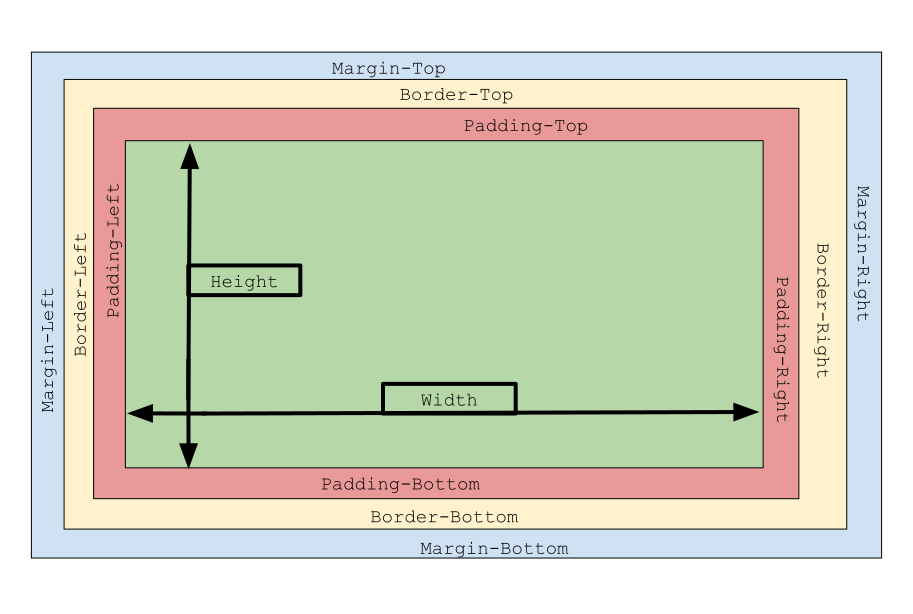
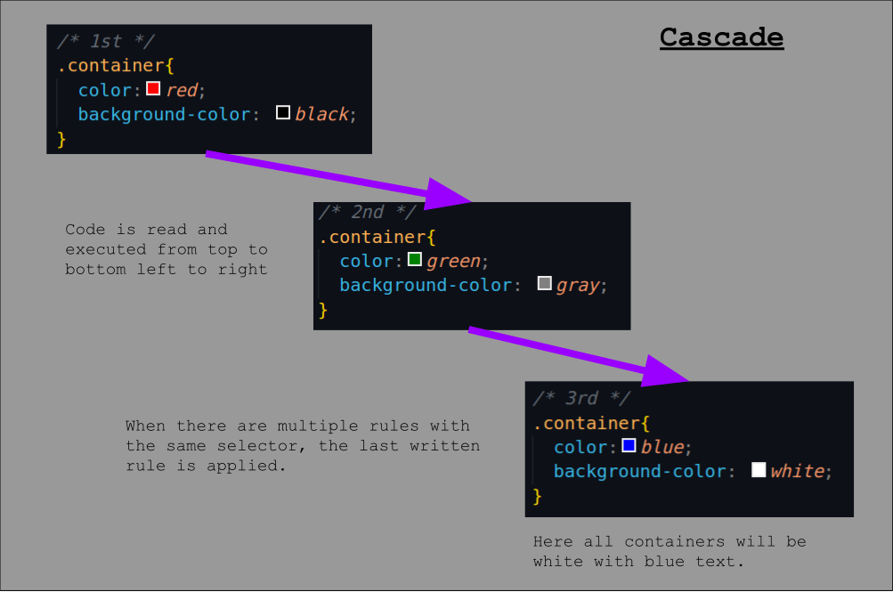
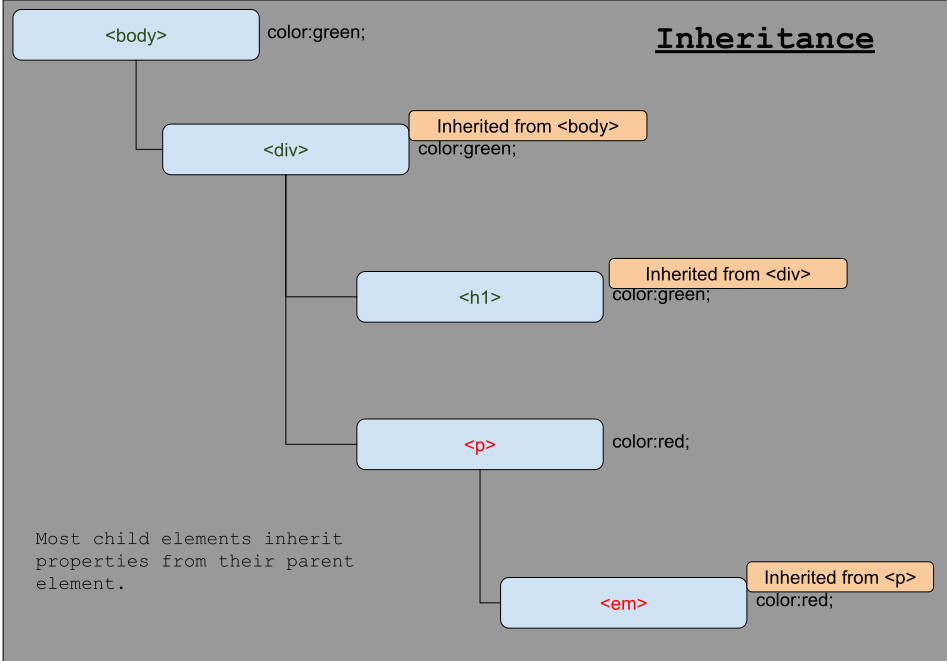
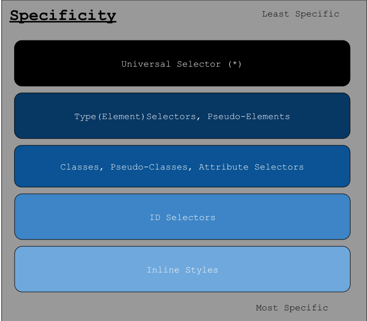
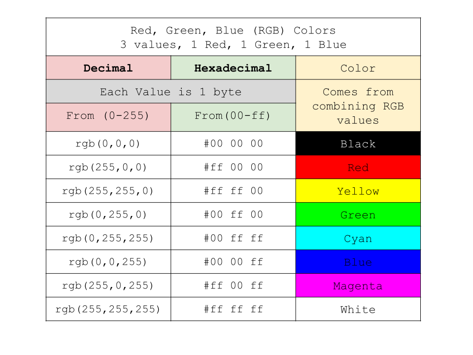

# `Cascading Style Sheets`

<br>

___

<br>

Covered in this file:
1. [`CSS Defined`](#css-defined)
    1. [`CSS Box Model`](#css-box-model)
    1. [`Cascade`](#cascade)
    1. [`Inheritence`](#inheritence)
    1. [`Specificity`](#specificity)
1. [`Comments`](#comments)
1. [`Selectors`](#selectors)
1. [`Classes`](#classes)
1. [`Pseudo-classes`](#pseudo-classes)
1. [`IDs`](#ids)
1. [`Declarations`](#declarations)
1. [`Rules`](#rules)
1. [`Declaration Block`](#declaration-block)
1. [`RGB Color Values`](#rgb-color-values)
1. [`Adding CSS to HTML`](#adding-css-to-html)
    1. [`External CSS`](#external-css)
    1. [`Internal CSS`](#internal-css)
    1. [`Inline CSS`](#inline-css)
1. [`HTML and CSS Example`](#html-and-css-example)


<br>

___

<br>


# `CSS Defined`

`CSS (Cascading Style Sheets)` is a style sheet language used for describing the 
presentation of a document written in HTML or XML. 
* It defines how elements are displayed on a web page, including their layout, colors, fonts, and other visual aspects. 
* CSS allows developers to separate the structure and content of a webpage from its presentation, providing flexibility and maintainability.


A `stylesheet` is a collection of rules that defines the appearance of HTML elements.

Can be external (linked file), internal (within HTML file), or inline (directly in an HTML tag).

<br>

## `CSS Box Model`
The `CSS Box Model` describes the layout of html elements as a box with content, padding, border, and margin.

```
  +---------------------------------------------+
  |                  Margin-top                 |
  |  +---------------------------------------+  |
  |  |               Border-top              |  |
  |  |  +---------------------------------+  |  |
  |  |  |            Padding-top          |  |  |
  |  |  |  +-------------------------+    |  |  |
  |  |  |  |          Content        |    |  |  |
  |  |  |  |                         |    |  |  |
  |  |  |  +-------------------------+    |  |  |
  |  |  |           Padding-bottom        |  |  |
  |  |  +---------------------------------+  |  |
  |  |              Border-bottom            |  |
  |  +-------------------------------------- +  |
  |                 Margin-bottom               |
  +---------------------------------------------+
```




<br>


## `Cascade`
The `cascade` in CSS is the process that determines which styles are applied to an element when there are multiple conflicting CSS rules. It follows three primary factors to resolve these conflicts:

* `Origin of Styles`: CSS styles from different sources (e.g., browser defaults, external stylesheets, inline styles) have varying priorities, with inline styles being the most dominant.

* `Specificity:` Selectors with higher specificity (e.g., inline styles, IDs, classes) override those with lower specificity (e.g., element or universal selectors).

* `Importance:` The `!important` rule overrides all other styles, regardless of specificity or origin, unless another `!important` style has higher specificity.

* `Order of Appearance:` When two rules have the same specificity, the style that appears later in the CSS or document takes precedence.



<br>

## `Inheritence`
`Inheritance` in CSS refers to how certain properties are passed down from parent elements to their children. If a property is inheritable, child elements will inherit the property value from their parent element unless it is explicitly overridden.



<br>

## `Specificity`
Specificity is a scoring system that ranks CSS selectors based on their types. 

<br>

1. Inline Styles: (e.g., `<div style="color: red;">`) → 1,000 points
2. ID Selectors: (e.g., `#main`) → 100 points
3. Class, Pseudo-Class, or Attribute Selectors: (e.g., `.container`, `:hover`, `[type="text"]`) → 10 points
4. Type (Element) Selectors or Pseudo-Elements: (e.g., `div`, `p::before`) → 1 point
5. Universal Selector: (`*`) → 0 points (very low specificity)

<br>



<br>

[`Back To Top`](#cascading-style-sheets)
___

<br>

# `Comments`
`CSS Comments` are made using an opening `/*` and a closing `*/`

<br>

```css
/* Single Line CSS Comment */
```
```css
/*
Multi
Line
CSS
Comment
*/
```

<br>

[`Back To Top`](#cascading-style-sheets)
___

<br>

# `Selectors`

A `CSS Selector` is a pattern used to select and style HTML elements. 
* Selectors can target elements, classes, IDs, attributes, or combinations of these.

syntax
```css
selector {
  /* Declaration Block */
}
```

<br>

example
```css
body{
  background-color: black;
}
```

<br>

[`Back To Top`](#cascading-style-sheets)
___

<br>

# `Classes`
A `CSS Class` A way to apply styles to multiple elements. 
* Define a CSS `class` with a period `.` and a name
* Attach the class to an HTML `element` with the class attribute.


syntax:
```css
.classname {
  /* Declaration Block */
}
```

example
```css
.highlight{
  color: yellow;
}
```

<br>

HTML Class Attribute
syntax:
```html
<tag class = "classname"> </tag>
```

example:

```html
<p class = "highlight"> This is a paragraph with a class attribute </p> 
```


<br>

[`Back To Top`](#cascading-style-sheets)
___

<br>

# `Pseudo-classes`
A CSS `Pseudo-class` is a keyword added to a selector to style a specific state or condition of an element.

```css
selector:pseudo-class {
  /* Declaration Block */
}
```
example:
```css
div:hover{
  background-color:aqua;
}
```


<br>

[`Back To Top`](#cascading-style-sheets)
___

<br>

# `IDs`
A `CSS ID` is similar to a class but should be unique on a page. 
* Define an ID with a hash `#` in CSS
* Attach an ID to an HTML Element with the id attribute.

syntax:
```css
#id {
  /* Declaration Block */
}
```

example:
```css
#special {
  border: 2pt solid black;
}
```

HTML ID Attribute syntax:
```html

<p id = "special"> This is a paragraph with a special attribute </p>

```
<br>

[`Back To Top`](#cascading-style-sheets)
___

<br>


# `Declarations`

A CSS `Property` an attribute of an element that you want to style. 
* Examples include color, font-size, margin, and background-color.

<br>

A CSS `Value` is the specific setting assigned to a CSS property. 
* For example, #333 is a value for the color property.

<br>

A CSS `Declaration` is the combination of a CSS `property` and its corresponding `value`. 
* Declarations are enclosed in curly braces `{}`.

<br>

syntax:

```css
selector {

    property: value;
    |--------------|
          |
      Declaration
}
```

external/internal css example:
```css 
body {
  color: #FF0000;
  background-color: rgb(0,0,0);
  font-size: 24px;
}
```

inline css example:
```html

<body style="background-color:rgb(0,0,0)"></body>
```

<br>

[`Back To Top`](#cascading-style-sheets)
___

<br>

# `Rules`
A `CSS Rule` consists of one or more declarations, associated with a selector and defines how the selected elements should be styled.

<br>

```
------------------------|
selector {              |
  property:value;       |
  property:value;       |--CSS Rule
  property:value;       |
}                       |
------------------------|
```

<br>

[`Back To Top`](#cascading-style-sheets)
___

<br>

# `Declaration Block`
A `declaration block` is a group of one or more declarations within curly braces `{}` that are apart of a CSS rule. 

```

selector {              
------------------------|
  property:value;       |
  property:value;       |--Declaration Block
  property:value;       |
------------------------|
}                       

```
<br>


<br>

[`Back To Top`](#cascading-style-sheets)
___

<br>


# `RGB Color Values`
The `RGB (Red, Green, Blue)` color model is a widely used color model in digital imaging and displays. It represents colors by combining different intensities of red, green, and blue light.

<br>

Each color component (R, G, B) is typically represented using 8 bits, which allows for 256 possible intensity levels (0 to 255). This results in a total of 16,777,216 (256 x 256 x 256) possible colors in a standard 24-bit RGB color space.

RGB Values can be represented in Decimal or Hexadecimal formats:

### `Example Colors:`
| Decimal (RGB)    | Hexadecimal     | Color   |
|:-:|:-:|:-:|
| rgb(0,0,0)       | #000000         | Black   |
| rgb(255,0,0)     | #FF0000         | Red     |
| rgb(255,255,0)   | #FFFF00         | Yellow  |
| rgb(0,255,0)     | #00FF00         | Green   |
| rgb(0,255,255)   | #00FFFF         | Cyan    |
| rgb(0,0,255)     | #0000FF         | Blue    |
| rgb(255,0,255)   | #FF00FF         | Magenta |
| rgb(255,255,255) | #FFFFFF         | White   |

<br>



<br>

Explore further: [W3Schools Color Picker](https://www.w3schools.com/colors/colors_picker.asp)


<br>

[`Back To Top`](#cascading-style-sheets)
___

<br>

# `Adding CSS to HTML`
There are 3 ways to add CSS to an HTML File
* `External CSS` --> In a separate file (`styles.css`)
* `Internal CSS` --> Inside of `<style>` tags
* `Inline CSS` --> Using the `style` attribute

<br>

## `External CSS:`
CSS is stored in a separate external file (styles.css) and linked to the HTML document.

<br>

Use the `<link>` tag embed exteral CSS

syntax
```
<link rel="stylesheet" type="text/css" href="<FILEPATH>">
```

example
```html
<link rel="stylesheet" type="text/css" href="styles.css">
```

External styles.css file
```css
body {
    color: while;
    background-color:black;
}

h1 {
    text-align: center;
}
```

<br>


## `Internal CSS:`
The `<style>` tag is used to embed CSS Cascading Style Sheets within the HTML document.

<br>

syntax
```html
<style>
    selector {
        property:value;
        property:value;
        property:value;
    }

    selector {
        property:value;
        property:value;
        property:value;
    }

</style>
```

example
```html
<style>
    body {
        color: while;
        background-color:black;
    }

    h1 {
        text-align: center;
    }

</style>
```

<br>

## `Inline CSS:`
CSS is applied directly to individual HTML elements using the "style" attribute.

syntax
```html
<tagname style="property:value;">
```

example
```html
<h1 style="text-align:center;"> Hello World </h1>
```

<br>

[`Back To Top`](#cascading-style-sheets)
___

<br>

# `HTML and CSS Example`
```html
<!DOCTYPE html> 
<html lang="en-us"> 
  <head>
    <title>Page Title</title> 
    
    <!-- External CSS: Link to a CSS file for styling--> 
    <link rel="stylesheet" type="text/css" href="styles.css">

    <!--Internal CSS: use the <style> tag-->
    <style>

      /* This is an inline CSS comment */

      /*
        This is a multi-line comment
        in CSS.
      */
     
    </style>

  </head> 
  <body> 
    <!-- Inline CSS: <tagname style="property:value;"> -->

    <h1 style="color:green">This is a heading</h1> <!-- style="color:green" -->
    
    <p style="background-color: black;">This is a paragraph.</p> <!--style="background-color:black" -->
    
    <a href="https://www.w3schools.com">This is a link</a> 

     

    <div>

    </div>

  </body> <!-- This is the closing tag for the body of the HTML document -->
</html> <!-- This is the closing tag for the HTML document -->
```
Example styles.css file


```css
/* Resetting default margin and padding for all elements(*) */
* {
   margin: 0;
   padding: 0;
   box-sizing: border-box;
 }
 
 /* Applying styles to the body element */
 body {
   font-family: Arial, sans-serif; /* Setting the default font family */
   line-height: 1.6; /* Setting the line height for better readability */
   background-color: #f2f2f2; /* Setting the background color for the entire page */
   color: #333; /* Setting the default text color */
 }
 
 /* Styling the header element */
 h1 {
   color: #0066cc; /* Setting the color of level 1 headings */
 }
 
 /* Styling paragraphs */
 p {
   font-size: 16px; /* Setting the font size for paragraphs */
   color: #666; /* Setting the default text color for paragraphs */
   margin-bottom: 15px; /* Adding bottom margin for spacing between paragraphs */
 }
 
 /* Styling links */
 a {
   color: #0066cc; /* Setting the default color for links */
   text-decoration: none; /* Removing underlines from links */
 }
 
 /* Styling links on hover using a psuedo-class (:hover)*/

 a:hover {
   text-decoration: underline; /* Adding underline on hover for links */
 }
 
 /* Applying styles to a class named 'highlight' */
 .highlight {
   background-color: yellow; /* Setting background color for elements with the 'highlight' class */
   padding: 5px; /* Adding padding for better visual appearance */
 }
 
 /* Styling an element with a specific ID */
 #special-section {
   border: 1px solid #333; /* Adding a border to the element with the ID 'special-section' */
   padding: 10px; /* Adding padding for spacing inside the element */
 }
 
 /* Media query for responsive design */
 @media screen and (max-width: 600px) {
   /* Adjusting styles for smaller screens */
   body {
     font-size: 14px; /* Decreasing font size for smaller screens */
   }
 }
 ```

 <br>

[`Back To Top`](#cascading-style-sheets)
___

<br>

*Created and maintained by Mr. Merritt*