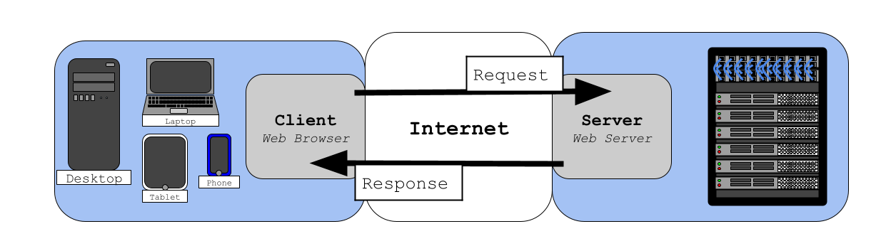

# Internet Communication
> **Internet:** shortened form of inter network. Inter from latin inter- meaning between. The internet is a vast network of interconnected computer networks that spans the globe. It allows communication and data exchange between devices (computers, smartphones, tablets, etc.) anywhere in the world.  

> Internet access is provided by an **Internet Service Provider (ISP)**.   

> An **ISP** is a company that provides access to the internet for individuals and organizations. They maintain the necessary infrastructure, including cables, towers, and data centers, to connect networks. Think of it like a bridge connecting your device to the vast network of interconnected computers that is the internet.  

# Internet Communication Models
> There are several different models used to communicate over the Internet. The most prominent model is the client server model.
 
## **Client Server Model**

> * The Client sends a request to the Server.
> * The Server sends a response to the Client.

> A **Client** is any program or device that initiates a communication session with a server to request a service or resource. 
> * In most cases the client is your web browser. 

> A **Server** is a computer program or physical device that provides services or resources to other devices, known as clients. Think of it as a central hub serving information and functionality to multiple users or devices on a network.
> * In most cases the server is what sends the web page to your browser. 

> The word **query** is often used in computer science, and can be thought of as a request.