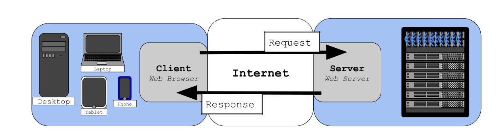

# `Internet Communication`
> [**Internet:**] shortened form of inter network. Inter from latin inter- meaning between. The internet is a vast network of interconnected computer networks that spans the globe. It allows communication and data exchange between devices (computers, smartphones, tablets, etc.) anywhere in the world.  

> Internet access is provided by an [**Internet Service Provider (ISP)**].   

> An [**ISP**] is a company that provides access to the internet for individuals and organizations. They maintain the necessary infrastructure, including cables, towers, and data centers, to connect networks. Think of it like a bridge connecting your device to the vast network of interconnected computers that is the internet.  
---
# `Internet Communication Models`
> There are several different models used to communicate over the Internet. The most prominent model is the client server model.
 
## **Client Server Model**


> * The Client sends a request to the Server.  
> * The Server sends a response to the Client.  

> A [**Client**] is any program or device that initiates a communication session with a server to request a service or resource.   
> * In most cases the client is your web browser.   

> A [**Server**] is a computer program or physical device that provides services or resources to other devices, known as clients. Think of it as a central hub serving information and functionality to multiple users or devices on a network.  
> * In most cases the server is what sends the web page to your browser.   

> The word [**query**] is often used in computer science, and can be thought of as a request.  
---

# `Locating the Server`
> Every device in a network, even a massive network like the internet, has an IP address. However IP addresses are not easy to remember so a system for managing these addresses is necessary. 

> A [**Domain Name**] is the human-readable name for a website, like google.com or wikipedia.org, that acts as a memorable and easy-to-remember address for accessing a website on the internet.
>  * Domain names are registered through [**domain registrars**] and mapped to an actual IP address through the [**Domain Name System (DNS)**].

> [**Domain Name System (DNS)**] translates human-readable domain names like "google.com" into IP addresses that computers can understand. 
> * DNS is essentially the internet's phone book or contacts app. 

## How DNS works:
1. You type a domain name into your web browser.
1. Your browser contacts a DNS server (usually provided by your internet service provider).
1. The DNS server checks its records for the corresponding IP address of the domain name.
1. If found, the IP address is sent back to your browser.
1. Your browser uses the IP address to connect to the web server hosting the website.

***Think of it like this:***
> * Domain names are like the names in your contacts.  
> * IP addresses are like phone numbers.  
> * DNS servers are like the contacts app that looks up the phone numbers for you.  

## Uniform Resource Locators (URL) --> Web Addresses.   
> [**URLs or web addresses**] are used to access resources on servers in a network.   
> These addresses can be broken down into their parts. 


> A [**protocol**] is  a set of rules and standards that govern how devices communicate and exchange data over a network.  

> [**Subdomains**] These are domains within a larger domain, created by adding a prefix to the existing name. For example, mail.google.com is a subdomain of google.com.  

> [**Domain**] name of the website.   

> [**Top-Level Domains (TLDs)**] These are the highest-level categories in the domain name system, like .com, .org, or .edu.  

> [**Port**] is a software defined number assigned to uniquely identify a connection endpoint and to direct data to a specific service.  

> [**File Path**] specifies the exact location of a file within the website's directory structure.The path starts from the root (/) and each directory is separated with a “/”.  

> The [**query string separator '?'**] is the delimiter that separates the main part of the URL from the query string.  

> The [**query string**] is a part of a URL that provides additional information to the web server about the requested resource. 
> 
> example:  
> https://www.google.com/search?q=cats  
>'*q=cats*' is the query string 

---
# `Sending the Request and Receiving the Response`

## HTTP(HyperText Transfer Protocol)
	
> [**HTTP**] is a protocol designed for transmitting information, like web pages, between web browsers (client) and web servers. Typically hosted on port 80.

>  [**HTTPS (HyperText Transfer Protocol Secure)**]is HTTP on top of an encryption layer (Transport Layer Security TLS)that protects the information traveling over the internet. Most browsers and servers use HTTPS. Typically hosted on port 443.

	
> [**HTTP Headers**] are lines of text that provide additional information about an HTTP request or response. They act like metadata, offering context and instructions for both the client (like a web browser) and the server to ensure smooth communication and efficient data transfer.

## HTTP request methods
> An [**HTTP Request Method**]  is a command sent from a client to a server that specifies the action to be performed on a resource, such as retrieving data (GET), submitting data (POST), updating data (PUT), or deleting data (DELETE).  
* **GET** - Retrieve information from the server
* **POST** - Send information to the server
* **PUT** - Update data on the server
* **DELETE** - Delete data on the server

More at  https://developer.mozilla.org/en-US/docs/Web/HTTP/Methods

## HTTP Response Status Codes
> [**HTTP Response Status Codes**] are standardized three-digit numbers returned by a server to indicate the outcome of a client's HTTP request, such as success (2xx), redirection (3xx), client errors (4xx), or server errors (5xx).  

[**100 - 199 Information Responses:**] 

[**200 - 299 Successful responses:**]  
_ 200  OK

[**300 - 399 Redirection Messages:**] 

[**400 - 499 Client Error responses:**]   
_ 400 Bad Request  
_ 401 Unauthorized  
_ 403 Forbidden  
_ 404 Not Found  
_ 405 Method Not Allowed  

[**500 - 599 Server Error responses:**]   
_ 500 Internal Server Error  
_ 503 Service Unavailable  

> To see the different codes check out: https://httpstat.us/

Check it out on the command line:
```
curl --verbose https://httpstat.us/<code here>
```

>More at https://developer.mozilla.org/en-US/docs/Web/HTTP/Status

> Take a look using Developer Tools 
> * press F12, Ctrl + Shift + I, or by using the browser menu to select More Tools --> Developer Tools.  
> * While using Developer Tools look for the '*Network*' tab.

---
